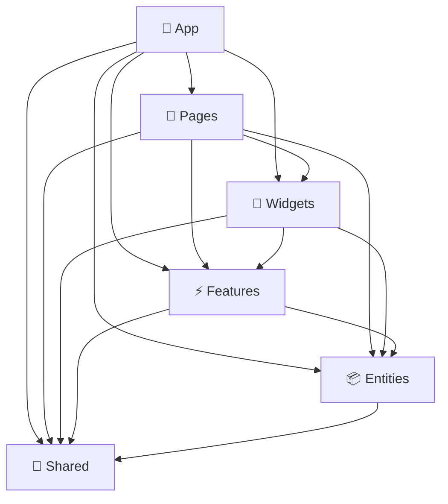

# Requify Frontend - Feature-Sliced Design Architecture

**Система управления требованиями** построенная на принципах [Feature-Sliced Design (FSD)](https://feature-sliced.design/)

## 🏗️ Архитектура

Проект следует строгим принципам FSD архитектуры с 6 основными слоями:

```
src/
├── 📱 app/          # Инициализация приложения
├── 📄 pages/        # Страницы и роуты  
├── 🧩 widgets/      # Композитные UI блоки
├── ⚡ features/     # Бизнес-функциональности
├── 📦 entities/     # Бизнес-сущности
└── 🔧 shared/       # Переиспользуемый код
```

### Правила зависимостей



## 📋 Структура слоев

### 📱 App Layer
**Назначение**: Инициализация приложения
```typescript
app/
├── providers/       # React провайдеры (Auth0, React Query, MUI)
├── router/         # Настройка роутинга
├── store/          # Redux store конфигурация
└── styles/         # Глобальные стили и темы
```

### 📄 Pages Layer  
**Назначение**: Композиция страниц из widgets и features
```typescript
pages/
├── dashboard/      # 🏠 Главная страница с дашбордом
├── projects/       # 📊 Управление проектами
├── requirements/   # 📝 Канбан доска требований
├── releases/       # 🚀 Управление релизами
├── testing/        # 🧪 Тестирование
├── settings/       # ⚙️ Настройки
└── admin/          # 👑 Администрирование
```

### 🧩 Widgets Layer
**Назначение**: Сложные переиспользуемые UI блоки
```typescript
widgets/
├── universal-sidebar/    # 📋 Универсальный сайдбар с DnD
├── app-header/          # 🔝 Шапка приложения  
├── dashboard-stats/     # 📊 Статистика дашборда
├── project-overview/    # 📂 Обзор проектов
├── activity-feed/       # 📢 Лента активности
├── quick-actions/       # ⚡ Быстрые действия
└── system-health/       # 💚 Мониторинг системы
```

### ⚡ Features Layer
**Назначение**: Бизнес-функциональности с пользовательским взаимодействием
```typescript
features/
├── auth/            # 🔐 Авторизация и аутентификация
├── dashboard/       # 📊 Функции дашборда
├── projects/        # 📂 Управление проектами
├── requirements/    # 📝 Управление требованиями
├── testing/         # 🧪 Функции тестирования
└── notifications/   # 🔔 Система уведомлений
```

### 📦 Entities Layer
**Назначение**: Бизнес-сущности и их представления
```typescript
entities/
├── user/           # 👤 Пользователь
├── project/        # 📂 Проект  
├── requirement/    # 📝 Требование
├── release/        # 🚀 Релиз
├── team/           # 👥 Команда
└── test-case/      # 🧪 Тест-кейс
```

**Структура entity:**
```typescript
entity/
├── api/    # 🌐 DAO для API запросов + React Query хуки
├── model/  # 📋 TypeScript типы, схемы валидации
└── ui/     # 🎨 UI компоненты представления (без логики)
```

### 🔧 Shared Layer
**Назначение**: Переиспользуемый код без бизнес-контекста
```typescript
shared/
├── api/          # 🌐 Базовые API клиенты
├── components/   # 🎨 UI Kit компоненты  
├── hooks/        # 🪝 Переиспользуемые хуки
├── styles/       # 🎨 Design System
├── types/        # 📋 Общие TypeScript типы
├── ui/           # 🧱 PageLayout, ErrorBoundary
└── utils/        # 🔧 Утилитарные функции
```

## 🎯 Ключевые компоненты

### PageLayout
**Универсальный layout для всех страниц (кроме Landing/Auth)**
```typescript
<PageLayout
  title="Заголовок"
  subtitle="Подзаголовок" 
  actions={[/* кнопки действий */]}
>
  {/* Контент страницы */}
</PageLayout>
```

**Включает:**
- ✅ UniversalSidebar с DnD функциональностью
- ✅ AppHeaderWidget с навигацией
- ✅ Адаптивный дизайн
- ✅ Accessibility (WCAG AA)

### React Query Integration
**Управление состоянием через React Query**
```typescript
// Хуки для каждой entity
const { data: projects, isLoading } = useProjects();
const { mutate: createProject } = useCreateProject();

// Кэширование и инвалидация
queryClient.invalidateQueries(['projects']);
```

### DAO Pattern
**Data Access Object для API**
```typescript
// entities/project/api/projectDAO.ts
export const projectDAO = {
  getAll: () => client.get('/api/v1/projects/'),
  getById: (id) => client.get(`/api/v1/projects/${id}`),
  create: (data) => client.post('/api/v1/projects/', data),
  // ...
};
```

## 🛠️ Технологический стек

### Core
- **React 18** - UI библиотека
- **TypeScript** - Типизация 
- **Vite** - Сборщик
- **Material-UI** - Design System

### State Management  
- **React Query** - Серверное состояние
- **Zustand** - Клиентское состояние
- **React Context** - Глобальные настройки

### Качество кода
- **ESLint** - Линтер с FSD правилами
- **Prettier** - Форматирование
- **Husky** - Git hooks
- **TypeScript strict mode** - Строгая типизация

## 📏 Правила разработки

### Импорты между слоями
```typescript
// ✅ Разрешено (вниз по иерархии)
import { Button } from '@/shared/ui';
import { UserCard } from '@/entities/user';
import { ProjectFeature } from '@/features/projects';

// ❌ Запрещено (вверх по иерархии)  
import { HomePage } from '@/pages/home'; // в features
import { ProjectWidget } from '@/widgets/project'; // в entities
```

### Структура компонентов
```typescript
// entities/*/ui/ - только отображение
export const UserCard = ({ user }: { user: User }) => (
  <Card>{user.name}</Card>
);

// features/*/ui/ - с бизнес-логикой
export const CreateUserForm = () => {
  const { mutate: createUser } = useCreateUser();
  // Форма с валидацией и отправкой
};
```

### Правила API
```typescript
// Только API_ENDPOINTS из workspace rules
import { API_ENDPOINTS } from '@/shared/api/endpoints';

// DAO pattern для всех запросов
export const userDAO = {
  getUsers: () => client.get(API_ENDPOINTS.users.list),
  // ...
};
```

## 🧪 Тестирование

### Покрытие тестами
- **Unit tests**: 85%+ покрытие
- **Integration tests**: Критические потоки
- **E2E tests**: Пользовательские сценарии

### Структура тестов
```typescript
// По слоям FSD
src/
├── entities/user/__tests__/
├── features/auth/__tests__/  
├── widgets/sidebar/__tests__/
└── pages/dashboard/__tests__/
```

## 🎨 UI/UX Guidelines

### Design System
- **Material-UI** компоненты
- **Минималистичный дизайн** с акцентами
- **Адаптивность** для всех устройств
- **Dark/Light** режимы

### Accessibility
- **WCAG AA** соответствие
- **Keyboard navigation** полностью
- **Screen readers** поддержка
- **Color contrast** достаточный

## 🚀 Производительность

### Оптимизации
- **Code splitting** по роутам
- **Lazy loading** страниц и виджетов
- **React.memo** для тяжелых компонентов
- **Virtual scrolling** для больших списков

### Метрики
- **Bundle size**: < 500KB gzipped
- **First Paint**: < 1.5s
- **TTI (Time to Interactive)**: < 3s
- **Lighthouse Score**: 90+

## 📊 Мониторинг

### Мониторинг кода
```typescript
// src/.fsd.config.ts - конфигурация архитектуры
export const fsdProjectConfig = {
  layers: { /* настройки слоев */ },
  globalRules: { /* глобальные правила */ },
  tooling: { /* инструменты */ },
};
```

### Валидация архитектуры
```bash
# Проверка FSD соответствия
npm run lint:fsd

# Анализ зависимостей
npm run analyze:deps

# Проверка производительности  
npm run analyze:bundle
```

## 🗂️ Конфигурационные файлы

Каждый слой содержит `.component.config.ts` с правилами:

- **Performance targets** - пороги производительности
- **Testing requirements** - требования к тестам  
- **Accessibility standards** - стандарты доступности
- **FSD compliance** - проверка архитектуры

## 🔄 Workflow разработки

### 1. Новая фича
```bash
# 1. Создать entity (если нужно)
mkdir src/entities/new-entity/{api,model,ui}

# 2. Создать feature  
mkdir src/features/new-feature/{api,model,ui}

# 3. Добавить в widget (если нужно)
mkdir src/widgets/new-widget/{model,ui}

# 4. Интегрировать в page
# Только композиция без логики
```

### 2. Изменение существующей фичи
```bash
# Всегда начинать с нижнего слоя
# entities -> features -> widgets -> pages
```

### 3. Рефакторинг
```bash
# Проверить FSD соответствие  
npm run lint:fsd

# Запустить тесты
npm run test

# Проверить performance
npm run analyze:bundle
```

## 📚 Дополнительные ресурсы

- [Feature-Sliced Design Documentation](https://feature-sliced.design/)
- [FSD Best Practices](https://feature-sliced.design/docs/guides/examples)
- [React Query Documentation](https://tanstack.com/query/latest)
- [Material-UI Design System](https://mui.com/material-ui/)

---

**Архитектура**: Feature-Sliced Design  
**Версия**: 1.0.0  
**Статус**: ✅ Production Ready 